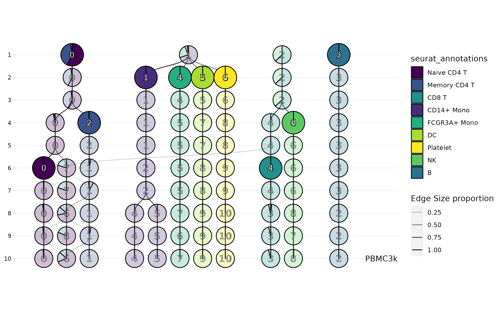

<!-- README.md is generated from README.Rmd. Please edit that file -->

```{r, include = FALSE}
knitr::opts_chunk$set(
  collapse = TRUE,
  comment = "#>",
  fig.path = "man/figures/README-",
  out.width = "65%",
  fig.align = "center"
)
```

# MRCO

**M**ulti **R**esolution **C**luster **O**ptimization 
 
<!-- badges: start -->

<!-- badges: end -->

```{r out.width = "100%" , fig.height=10, echo=FALSE, fig.cap="Stable Cluster Selection Across Multiple Resolutions. Be less dependent on your clustering algorithms resolution parameter!"}

```
\br
Visualize your clustering of multiple independently generated resolutions (or sensitivities) in a stacked tree like graph. Check if clusters remain in similar order across resolution change using the same clustering algorithm. Color clusters as pie-charts based on their sample proportions, if sample level metadata is included in the input, to see if cluster splitting is correlating with a split of metadata groups. If samples remain in same cluster grouping across many resolution 'steps', we assume a cluster to be stable. An automated cluster selection algorithm is implemented to select the 'most stable' clusters relative within the given data. Samples that frequently change between clusters upon change in resolution depict an uncertain state. Therefore, a 'debris' cluster is created if samples are not part of any of the selected stable clusters.\
The software was tested on single cell RNA-Sequencing data, but can be applied to any type of data (on your own risk). The general concept remains the same: A clustering algorithm can cluster your data similar multiple times, the similarity between multiple reiterations can be used to infer the most stable configuration for your experimental scope.

# Installation

You can install the development version of MRCO from [GitHub](https://github.com/peterwolf4/MRCO) with:

``` r
# install.packages("devtools")
devtools::install_github("peterwolf4/MRCO")
```

# Example

## Example data

`MRCO` comes with some example_data for a quick introduction. The required input is a single dataframe or tibble with: \itemize{
\item **required:** Samples (rows) and increasing clustering resolutions (columns)
\item optional: Extra metadata variables (columns) for your samples (rows)
} . In single cell RNA-Seq data for example expected input data is cells (rows) and increasing clustering resolution (columns). Metadata variables can be continuous (automatically binned) or discrete.

```{r load_example_data}
# Load MRCO
library(MRCO)
# Load example data
data("example_data")
# Check example data
head(example_data)
# Required: the clustering results saved in columns 6 to 9
# Optional: the sample level metadata saved in columns 1 to 5
# When merging clustering results and metadata manually verify that rows match!
```

## Running MRCO

### Plot

`MRCO` can run with just the clustering results. In the example data the lowest resolution clustering has one cluster and the highest resolution 4. This example could be the result of 4 k-mers clustering iterations with `k = 1,2,3,4`. Note that `example_data` is arbitrary sampled for example purposes only. `MRCO` needs to know which columns contain the clustering results. `clustering_columns` uses [`tidy-select`](https://tidyselect.r-lib.org/-select) to enable users a well established column selection method. By default, passing a single character is handled as prefix. `plot` can be used to suppress plotting and only receive stable clustering results.

```{r run_MRCO1, fig.show='asis', fig.cap="Fig. 1: A simple MRCO plot example"}
MRCO(example_data, clustering_columns = starts_with("0."))
# Is the same as
MRCO(example_data, clustering_columns = "0.", plot = FALSE)
```

Usually `MRCO` is used to plot metadata variables of interest as piecharts. `metadata_column_name` can be a character or unquoted name of the column of interest. `highlight_selection` can disable highlighting of stable nodes, more on selection in topic [Stable Cluster Selection].
`no_labels` can be used to remove cluster ids from nodes.

```{r , fig.show='animate'}
# We can plot metadata variables as piecharts and see how samples cluster.
MRCO(example_data,
  metadata_column_name = "quality",
  clustering_columns = "0."
)
# same as writing quality with the quotes
MRCO(example_data,
  metadata_column_name = quality,
  clustering_columns = "0.", no_labels = TRUE
)
```

### Example interpretation
Example data is sampled in a way that it resembles frequent real data scenarios.
Given examples are of course no final conclusions. They are to demonstrate how the plot can be exploited to quickly draw high level conclusions about your data. Generally, users will want to find some experimental variable from metadata to be linked to a specific sub-cluster in the data.
```{r run_MRCO3, fig.show='animate', fig.cap="Fig. 3: Example interpretation for MRCO graphs, metadata variable A"}
# MRCO can preview columns of input data when using a pipe to feed the metadata
# Numerical metadata will be binned, set number of bins with nbin
# Example A: graph hints that cluster 3 at resolution step 4 (4_3);
# is split based on expression values of A. (All samples in 4_3 have high values of A)
example_data %>% MRCO("expr_A", "0.", nbins = 5)

# Example B: graph hints that lefthand clusters have rather high-;
# while lefthand have rather low- values of expr_B.
example_data %>% MRCO("expr_B", "0.")
```

### Stable Cluster Selection
Nodes of the `MRCO` graph have a unique id that is created by pasting resolution step and clusters id from that resolution step. A node at first resolution step that has the cluster id 0 is therefore refered to as 1_0.
Selecting clusters of interest for further downstream analysis was made as dynamic as possible for the user.
In the given example, imagine we want to retain all samples of 4_3 as one cluster to investigate which samples have such high expression values of A,
but also need all other samples in second step clusters before the separation of B.
`MRCO` enables you to pick any of the clusters manually at wish.
Use `merge_downwards = TRUE` (default) to preserve clusters from lower resolutions.
`MRCO` returns a list with:
\itemize{
\item `MRCO_clustering` dataframe of each sample and its new MRCO clustering assignment
\item `graph_layout` tbl_graph of the igraph used to create the MRCO plot
\item `selected_nodes` character vector of every node that was selected as stable cluster
\item `plot` ggraph object of the plot for custom modifications
}

```{r run_MRCO5, fig.cap="Fig. 5: Example manual node selection"}
# MRCO highlights selected clusters visually.
MRCO_clustering <- MRCO(example_data,
  clustering_columns = "0.",
  nodes_selection = c("4_3", "2_0", "2_1"),
  merge_downwards = FALSE
)

# Each node has a unique cluster number composed of 'resolution'_'cluster'.
# Output is returned in order of input.
head(MRCO_clustering$MRCO_clustering)
table(MRCO_clustering$MRCO_clustering$id)
```

### Automated Stable Cluster Suggestion

By default `MRCO` runs a stable cluster suggestion. The idea of stable clusters is not represented well in this minimal example.
If a cluster does not change its composition across most of the tested resolution steps it is selected as stable. This way the selected clusters should represent the data groups best.
By choosing stable clusters independently, rather than from a single resolution, `MRCO` minimizes the distance its final clustering has to each of the tested input resolutions. 
Documentation on the details of stable cluster selection is planned.
`suggest_cut` can be set to FALSE to speed up runtime when only plotting.

```{r run_MRCO6, fig.cap="Fig. 6: Example usage of stable node suggestion"}
# Stable clusters are relative to the data and should still be checked
# Note that this example data is too small for the algorithm to be truthfully useful.
MRCO_clustering <- MRCO(example_data, clustering_columns = "0.", suggest_cut = TRUE)

# Check which nodes are stable
MRCO_clustering$selected_nodes
```

## Disclaimer

Package is currently in development. Planned for release on bioconductor. 
Feel free to reach out regarding bugs and ideas.
