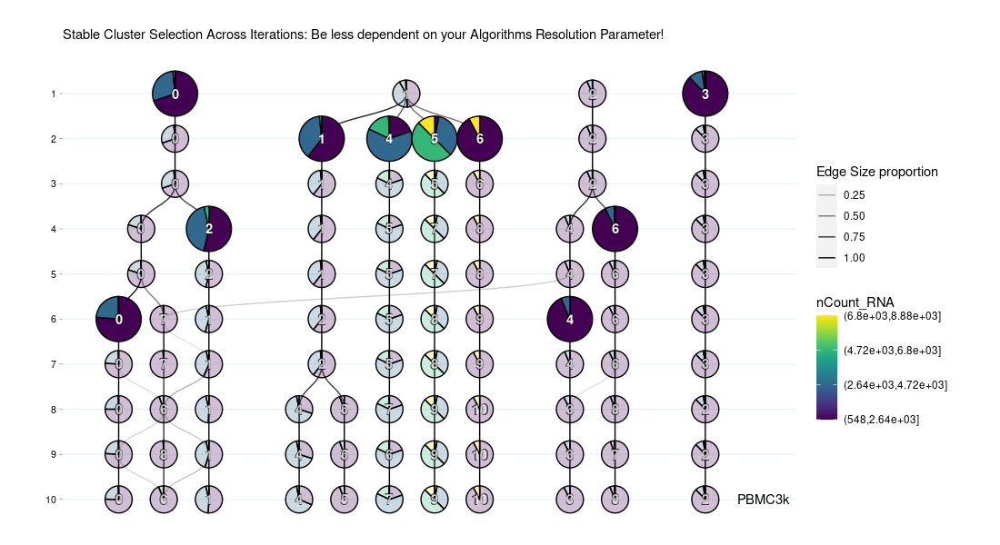
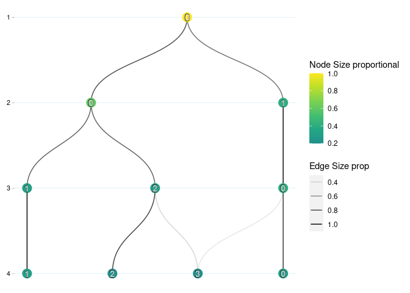
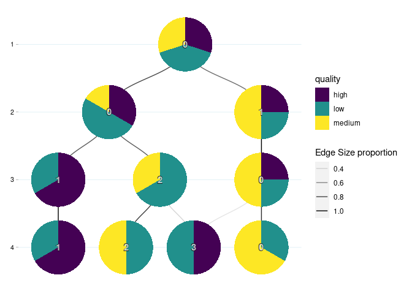
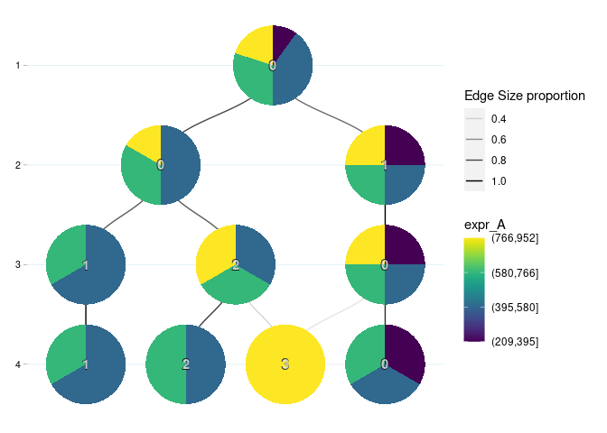
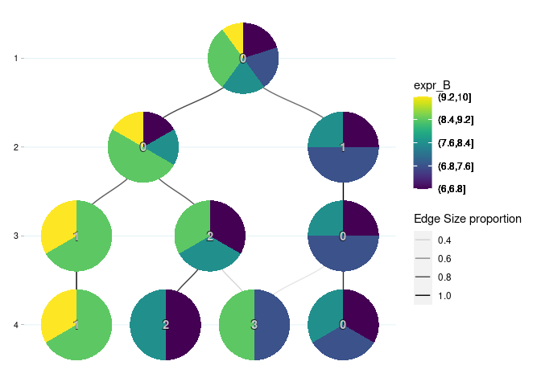
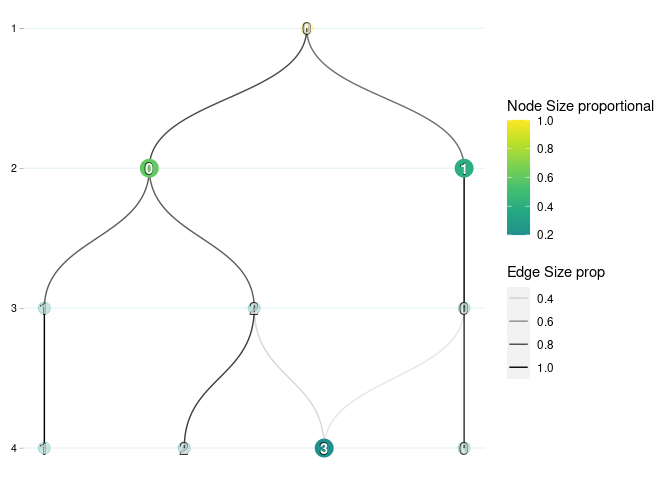
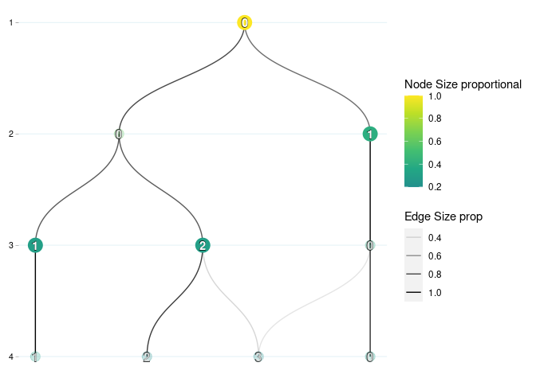

<!-- README.md is generated from README.Rmd. Please edit that file -->

# MRCO

**M**ulti **R**esolution **C**luster **O**ptimization
<!-- badges: start --> <!-- badges: end -->


Visualize your clustering of multiple independently generated
resolutions (or sensitivities) in a stacked tree like graph. It shows if
clusters remain in similar order across resolution change of
reiterations using the same clustering algorithm. Color clusters as
pie-charts based on their sample proportions, if sample level metadata
is included in the input, to see if cluster splitting is correlating
with a split of metadata groups. If samples remain in same cluster
grouping across many resolution ‘steps’, we assume a cluster to be
stable. An automated cluster selection algorithm is implemented to
select the ‘most stable’ clusters relative within the given data.
Samples that frequently change between clusters upon change in
resolution depict an uncertain state. Therefore, a ‘debris’ cluster is
created if samples are not part of any of the selected stable
clusters.  
The software was tested on single cell RNA-Sequencing data, but can be
applied to any type of data (on your own risk). The general concept
remains the same: A clustering algorithm can cluster your data similar
multiple times, the similarity between multiple reiterations can be used
to infer the most stable configuration for your experimental scope.

# Installation

You can install the development version of MRCO from
[GitHub](https://github.com/) with:

``` r
# install.packages("devtools")
devtools::install_github("peterwolf4/MRCO")
```

# Example

``` r

# Load MRCO
library(MRCO)

data("example_data")
# Load Example dataframe


# Required:
# Dataframe or Matrix of samples (rows) and increasing clustering resolutions (columns).
# In single cell this will be: cells (rows) and increasing clustering resolution (columns)
# The provided example data has its clustering results saved from column 6 to 9.
example_clustering <- example_data[,seq(6,9)]
head(example_clustering)
#>   0.1 0.2 0.3 0.4
#> 1   0   1   0   3
#> 2   0   0   2   3
#> 3   0   1   0   0
#> 4   0   1   0   0
#> 5   0   1   0   0
#> 6   0   0   1   1

# Optional:
# Extra metadata variables (columns) for your samples (rows). 
# Variable can be continuous (automatically binned) or discrete.
# Note that given metadata & clustering is arbitrary. 
head(example_data[,seq(1,5)])
#>   quality batch  sample expr_A expr_B
#> 1    high     1  cell_1    951      7
#> 2     low     1 cell_10    900      9
#> 3  medium     2  cell_2    210      7
#> 4  medium     3  cell_3    503      8
#> 5     low     1  cell_4    631      6
#> 6    high     3  cell_5    700     10


# MRCO takes both clustering and metadata info as single dataframe input.
# When merging clustering results and metadata manually verify that rows match!
# A typical full input data looks like this:
head(example_data)
#>   quality batch  sample expr_A expr_B 0.1 0.2 0.3 0.4
#> 1    high     1  cell_1    951      7   0   1   0   3
#> 2     low     1 cell_10    900      9   0   0   2   3
#> 3  medium     2  cell_2    210      7   0   1   0   0
#> 4  medium     3  cell_3    503      8   0   1   0   0
#> 5     low     1  cell_4    631      6   0   1   0   0
#> 6    high     3  cell_5    700     10   0   0   1   1
```

``` r
# Running MRCO
# We can run the function with just the clustering results:
# Lowest resolution clustering has one cluster and the highest resolution 4.
# This example could be the result of 4 k-mers clusterings with k = 1,2,3,4.
MRCO(example_clustering)
#> Arguments prefix and suffix are highly suggested! Please make sure that MRCO can identify each clustering resolution column.
```



``` r

# MRCO is verbose when it comes to warnings. We can also use our merged data. 
# Missing inputs prefix and/or suffix to target clustering result columns.
MRCO(example_data, prefix = "0.")
```


``` r

# We can plot metadata variables as piecharts and see how samples cluster.
MRCO(example_data, metadata_column_name = "quality",prefix = "0.")
```



``` r
# The example data shows no clear seperation based on sample quality.

MRCO(example_data, metadata_column_name = "expr_A",prefix = "0.")
```



``` r
# Example A: graph hints that cluster 3 at resolution step 4 (4_3);
# is split based on expression values of A. (All samples in 4_3 have high values of A)

MRCO(example_data, metadata_column_name = "expr_B",prefix = "0.")
```



``` r
# Example B: graph hints that lefthand clusters have rather high-;
# while lefthand have rather low- values of B.

# Given examples are of course no final conclusions.
# Rather, they are for a quick visual overview of your variables of interest, 
# and if they correlate to your clustering results.


# Selecting clusters of interest for further downstream analysis:
# Imagine we want to retain all samples of 4_3 as oner cluster to investigate A,
# but also need all other samples in second step clusters before the separation of B.
# MRCO enables you to pick any of the clusters manually at wish.
# Use merge_downwards (default) to preserve clusters from lower resolutions.
MRCO_clustering <- MRCO(example_data, prefix = "0.", 
     nodes_selection = c("4_3","2_0","2_1"),
     merge_downwards = FALSE)
```



``` r

# MRCO highlights selected clusters visually. 
# Each sample now has a unique cluster number composed of 'resolution'_'cluster'.
# Output is returned in order of input.
head(MRCO_clustering$nodes_selected$cells_NonGlobalClustering,3)
#>   cell  id
#> 1    1 4_3
#> 2    2 4_3
#> 3    3 2_1
table(MRCO_clustering$nodes_selected$cells_NonGlobalClustering$id)
#> 
#> 2_0 2_1 4_3 
#>   5   3   2

# Automated Stable Cluster Detection
# Note that stable clusters are relative to the data and should still be checked!
# Note that this example data is too small for the algorithm to be truthfully useful.
MRCO_clustering <- MRCO(example_data, prefix = "0.", suggest_cut = TRUE)
```



``` r

# Stable clusters are representative for the trees 'branches'. 
# We can check which clusters were selected as stable, just as before:
MRCO_clustering$nodes_selected$nodes_selection
#> [1] "1_0" "2_1" "3_1" "3_2"
# We see that automated suggestion found the first cluster to be 'stable' already.
# This is not a problem though, since merge_downwards = FALSE prefers the sub clusters.
head(MRCO_clustering$nodes_selected$cells_NonGlobalClustering, 3)
#>   cell  id
#> 1    1 2_1
#> 2    2 3_2
#> 3    3 2_1

# In larger datasets you likely won't see general clusters selected as stable,
# since more information is available to detect the most stable candidates.
```

## Disclaimer

Package is currently in development. Planned for release on
bioconductor. Good & reliable single cell clustering results have
already been found. Do use at your own caution though! Feel free to
reach out regarding bugs and ideas.
